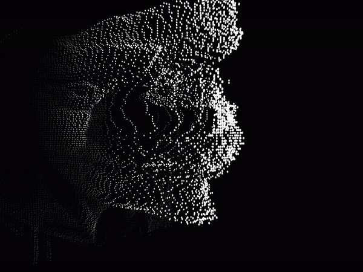

  
  

  <h1 align="center">👋 Hi, I'm Buntrok</h1>

 -  🎓 I'm Student System of Information
 -  💻 I’m currently learning Web Development
 -  🎮 My favorite hobby and video game
 

  

  <a href="https://github.com/GuilhermeBuntrok">
  
  

  

 <h2>🚀 Languages and Tools:</h2>

 
  
  
  
  
  
  
  
  
  

 
 
 

 <h2>Connect with me:</h2>

<a href="https://www.twitch.tv/guizaox">
<a href="https://steamcommunity.com/id/Buntrok/">

